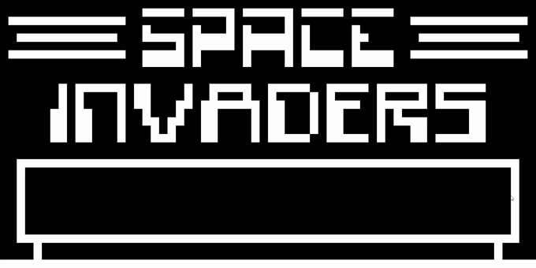

Rusty CHIP-8  Emulator
----------------------

CHIP-8 emulator written in Rust.

 - Runs on Windows, Linux and MacOS
   - Downloadable binaries can be found on the [GitHub Releases](https://github.com/realmar/rusty-chip-8-emu/releases) page or via GitHub Actions if you are logged in
 - Configurable using `config.yml`
   - Emulator Speed
   - Screen Scaling
   - Custom key-mappings, configurable per ROM
     - [See here for keycode names](https://docs.rs/ggez/0.3.3/ggez/event/enum.Keycode.html)
 - Hot reload emulator with new config (hz, rom, etc.)
   - Default key: `R`
 - Simple Debugger
   - Pause
   - Step back and forth
 - Instruction Logging (set log level to `TRACE`)

### Invaders

### BRIX

### Sources

I used following resources to implement the emulator:

 - [Wikipedia CHIP8](https://en.wikipedia.org/wiki/CHIP-8)
 - [CHIP-8 Emulator (@realemulator101)](http://www.emulator101.com/chip-8-emulator.html)
 - [CHIP‐8 Technical Reference (mattmikolay)](https://github.com/mattmikolay/chip-8/wiki/CHIP%E2%80%908-Technical-Reference)
 - [How to write an emulator (Laurence Muller)](http://www.multigesture.net/articles/how-to-write-an-emulator-chip-8-interpreter/)
 - [Chip-8 Public Domain ROMs](https://www.zophar.net/pdroms/chip8.html)
